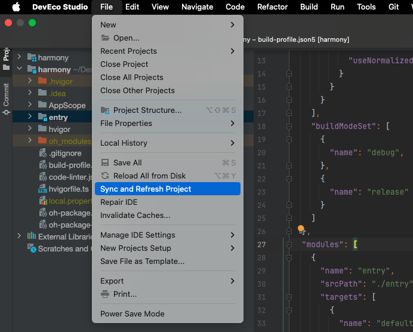
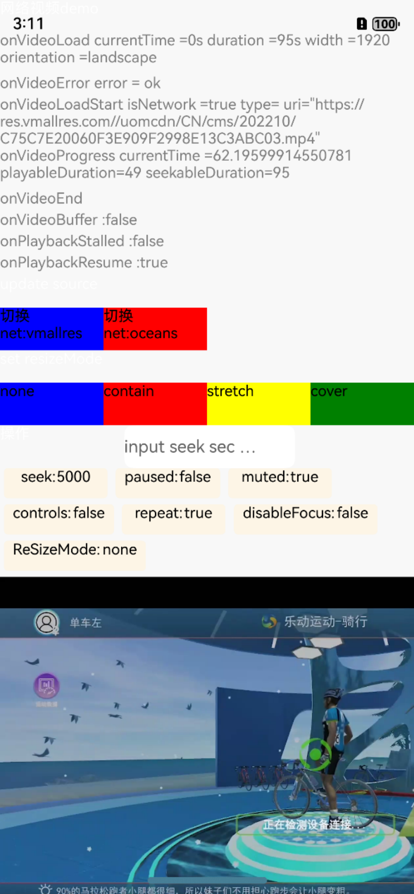

# RN Video 鸿蒙系统适配演示

## 项目简介

本项目旨在演示 React Native 项目集成 [`react-native-video`](https://github.com/react-native-oh-library/react-native-video/tree/sig) 插件在鸿蒙系统(HarmonyOS)上的运行表现。由于目前鸿蒙系统相关的 RN SDK 未开源，本项目提供了一个可行的解决方案。

## 功能特性

- 完整展示 [`react-native-video`](https://github.com/react-native-oh-library/react-native-video/tree/sig) 在鸿蒙系统上的适配方案
- 提供视频播放基础功能演示
- 解决鸿蒙系统 RN SDK 不开源的相关问题

## 环境要求

- React Native >= 0.63.0
- react-native-video >= 5.0.0
- HarmonyOS 2.0 及以上
- Node.js >= 14.0.0
- Yarn

## 安装步骤

1. 克隆项目

```bash
git clone git@github.com:bozaigao/harmony_use_video.git
```


2. 项目根目录创建并进入 libs 目录

```bash  
mkdir libs
cd libs
```

3. 克隆依赖项目

# 克隆鸿蒙RN适配核心库
```bash
git clone git@github.com:bozaigao/rnoh.git
```

# 初始化相关C++子模块
```bash
cd rnoh
git submodule update --init --recursive
cd ..
```

4. 返回项目根目录并安装依赖

```bash
cd ..
yarn install
```


5. 运行项目

直接使用DevEco Studio打开harmony然后运行项目
如果出现依赖报错问题，请先执行以下sync操作：


# Harmony运行效果图
